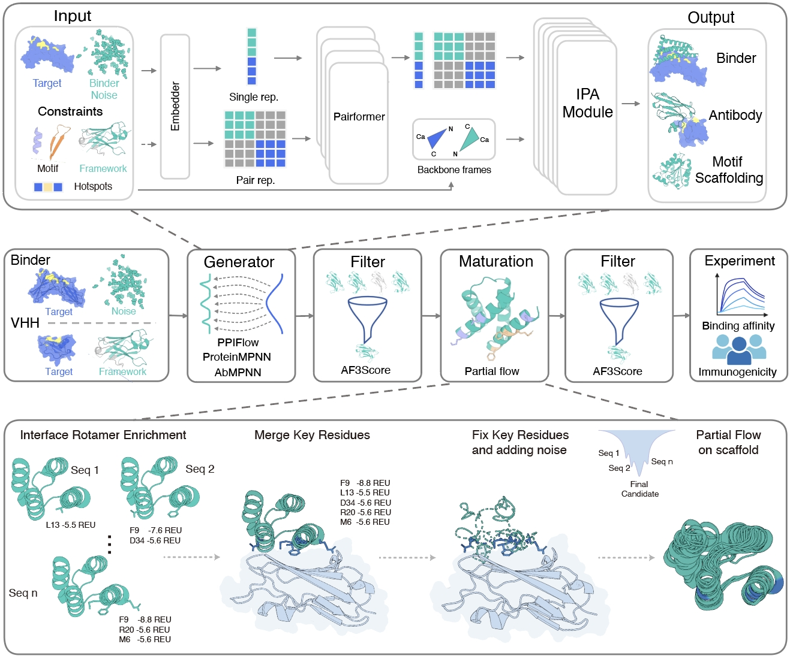

# PPIFlow User Guide



PPIFlow demonstrated a flow-matching-based framework and integrated design workflow for the de novo generation of high-affinity binders targeting precise epitopes. It supports a diverse range of tasks including protein-protein interaction (PPI) binders, nanobodies, antibodies, motif scaffolding, and unconditional monomer generation. [PPIFlow paper](https://drive.google.com/file/d/1oAchQfnbHookwftWcMIAmT_sYu4nAGBs/view?usp=drive_link)

We provide a **demo** to illustrate the complete workflow.  
All steps of the pipeline are presented in **`demo_vhh.ipynb`**, from backbone generation and sequence design to affinity evaluation, allowing users to reproduce the full VHH design process.


## Environment Setup

### 1. Clone the Repository

```bash
git clone https://github.com/Mingchenchen/PPIFlow.git
cd PPIFlow
```

### 2. Create Conda Environment

```bash
conda env create -f environment.yml
conda activate ppiflow
```

### 3. Download Model Checkpoints
Download the required checkpoints from [Google Drive](https://drive.google.com/drive/folders/1BcIBUL2yq1gOchHfN68-AcZK3hiMAMVN?usp=drive_link)

| Task Type | Checkpoint Path |
|------------|-----------------|
| Binder | `binder.ckpt` |
| Antibody | `antibody.ckpt` |
| Nanobody | `nanobody.ckpt` |
| Monomer or Motif Scaffolding  | `monomer.ckpt` |


## Usage Examples

### 1. Binder Design

Design a binding protein for a target protein.

```bash
python sample_binder.py \
    --input_pdb /path/to/target.pdb \
    --target_chain B \
    --binder_chain A \
    --config /path/to/configs/inference_binder.yaml \
    --specified_hotspots "B119,B141,B200" \
    --samples_min_length 75 \
    --samples_max_length 76 \
    --samples_per_target 5 \
    --model_weights /path/to/model/binder.ckpt \
    --output_dir /path/to/output/binder_test \
    --name IL7Ra
```

**Parameters:**
| Parameter | Description |
|-----------|-------------|
| `--input_pdb` | Path to target protein PDB file |
| `--target_chain` | Chain ID of target protein |
| `--binder_chain` | Chain ID of binder |
| `--specified_hotspots` | Hotspot residues, comma-separated |
| `--samples_min_length` | Minimum sequence length for sampling |
| `--samples_max_length` | Maximum sequence length for sampling |
| `--samples_per_target` | Number of samples per target |
| `--model_weights` | Path to model checkpoint |

---

### 2. Antibody Design

Design antibody CDR regions for an antigen.

```bash
python sample_antibody_nanobody.py \
    --antigen_pdb /path/to/antigen.pdb \
    --framework_pdb /path/to/antibody_framework.pdb \
    --antigen_chain C \
    --heavy_chain A \
    --light_chain B \
    --specified_hotspots "C11,C14,C15,C101,C107,C108" \
    --cdr_length "CDRH1,8-8,CDRH2,8-8,CDRH3,10-20,CDRL1,6-9,CDRL2,3-3,CDRL3,9-11" \
    --samples_per_target 5 \
    --config /path/to/configs/inference_nanobody.yaml \
    --model_weights /path/to/model/antibody.ckpt \
    --output_dir /path/to/output/antibody_test \
    --name 1IJZ_IL13
```

**Parameters:**
| Parameter | Description |
|-----------|-------------|
| `--antigen_pdb` | Path to antigen PDB file |
| `--framework_pdb` | Path to antibody framework PDB file，The framework PDB should include both heavy and light chains. CDR positions must be labeled using **IMGT numbering**, and the CDR loops resdiues should be removed. |
| `--antigen_chain` | Chain ID of antigen in antigen pdb |
| `--heavy_chain` | Chain ID of heavy chain in framework pdb |
| `--light_chain` | Chain ID of light chain in framework pdb |
| `--specified_hotspots` | Hotspot residues on antigen pdb |
| `--cdr_length` | CDR length constraints: `CDRH1,start-end,CDRH2,start-end,...` |

---

### 3. Nanobody Design
This notebook(```demo_vhh.ipynb```) demonstrates the end-to-end computational pipeline for designing VHH (Nanobody) binders. We use a combination of deep learning-based backbone generation, sequence design, and flow-based affinity maturation.

```bash
python sample_antibody_nanobody.py \
    --antigen_pdb /path/to/antigen.pdb \
    --framework_pdb /path/to/nanobody_framework.pdb \
    --antigen_chain C \
    --heavy_chain A \
    --specified_hotspots "C101,C135,C171,C198" \
    --cdr_length "CDRH1,8-8,CDRH2,8-8,CDRH3,9-21" \
    --samples_per_target 5 \
    --config /path/to/configs/inference_nanobody.yaml \
    --model_weights /path/to/model/nanobody.ckpt \
    --output_dir /path/to/output/nanobody_test \
    --name 1CVS_FGFR1
```

---

### 4. Monomer Generation

Generate monomer protein structures unconditionally.

```bash
python sample_monomer.py \
    --config /path/to/configs/inference_unconditional.yaml \
    --model_weights /path/to/model/monomer.ckpt \
    --output_dir /path/to/output/monomer_test \
    --length_subset "[50, 100]" \
    --samples_num 5
```

**Parameters:**
| Parameter | Description |
|-----------|-------------|
| `--length_subset` | Protein length subset, JSON format |
| `--samples_num` | Number of samples per length |

---

### 5. Motif Scaffolding

Generate new protein structures based on known Motif scaffolds.

```bash
python sample_monomer.py \
    --config /path/to/configs/inference_scaffolding.yaml \
    --model_weights /path/to/model/monomer.ckpt \
    --output_dir /path/to/output/motif_test \
    --motif_csv /path/to/motif_metadata.csv \
    --motif_names "['01_1LDB']" \
    --samples_num 5
```

**Parameters:**
| Parameter | Description |
|-----------|-------------|
| `--motif_csv` | Path to motif metadata CSV file |
| `--motif_names` | Motif names in `motif_csv` to use, JSON format list |

**Motif CSV Format Example:**
| target | length | contig | motif_path |
| :--- | :--- | :--- | :--- |
| 01_1LDB | 125 | 0-100,A1-21,0-100 | 01_1LDB.pdb |

- **length:** Total length of the scaffolded protein.
- **contig:** Notation defining the motif position. e.g., `0-100,A1-21,0-100` means a variable length of 0-100 residues flanking the fixed motif (Chain A, residues 1-21).

---

### 6. Partial Flow
Partial flow is a specialized sampling strategy in generative protein modeling that enables the local redesign of an existing protein structure.

#### Antibody

```bash
python sample_antibody_partial_flow.py \
--complex_pdb antibody_sample.pdb \
--fixed_positions A97-111 \
--cdr_position A26-33,A51-58,A97-111,B149-155,B173-175,B212-221 \
--specified_hotspots C320 \
--start_t 0.5 \
--samples_per_target 3 \
--output_dir test_partial_flow_antibody \
--retry_Limit 10 \
--config configs/inference_nanobody.yaml \
--model_weights ckpt/antibody.ckpt \
--antigen_chain C \
--heavy_chain A \
--light_chain B \
--name test
```

**Parameters:**
| Parameter | Description |
|-----------|-------------|
| `--complex_pdb` | Path to the PDB file containing the antibody-antigen complex structure. |
| `--fixed_positions`| Specifies the indices of residues that must remain stationary during the partial flow. |
| `--cdr_position` | The indices of the CDR loop.  |
| `--specified_hotspots` | Hotspot residues on antigen pdb |
| `--start_t` | The timestep at which the flow begins ($0 \leq t \leq 1$). Larger values preserve more of the input structure (refinement), while lower values allow for more stochastic redesign. |
| `--samples_per_target` | The number of samples to generate. |
| `--output_dir` | The directory where generated PDB files will be saved. |
| `--retry_Limit` | Maximum number of attempts to regenerate a structure if the current run fails filters. |
| `--config` | Path to the configuration file (YAML) containing model hyperparameters and runtime settings. |
| `--model_weights` | Path to the pre-trained model weights file. |
| `--antigen_chain` | Chain ID of antigen in antigen pdb |
| `--heavy_chain` | Chain ID of heavy chain in framework pdb |
| `--light_chain` | Chain ID of light chain in framework pdb |

#### Nanobody

```bash
python sample_antibody_partial_flow.py \
--complex_pdb nanobody_sample.pdb \
--fixed_positions A98-109 \
--cdr_position A26-33,A51-58,A98-109 \
--specified_hotspots C111,C114,C115,C201,C207,C208 \
--start_t 0.8 \
--samples_per_target 3 \
--output_dir test_partial_flow_nanobody \
--retry_Limit 3 \
--config configs/inference_nanobody.yaml \
--model_weights nanobody.ckpt \
--antigen_chain C \
--heavy_chain A \
--name test
```

#### Binder

```bash
python sample_binder_partial.py \
--input_pdb sample_input.pdb \
--config ./configs/inference_binder_partial.yaml \
--target_chain B --binder_chain A \
--start_t 0.7 \
--output_dir ./outputs
```


